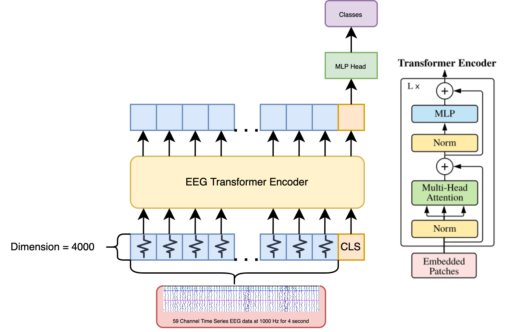

# EEG-Transformer
A ViT based transformer applied on multi-channel time-series EEG data for motor imagery classification. 

The repository contains code that is highly experimental. 

## Model High-Level Architecture


## Model Low-Level Architecture
```
----------------------------------------------------------------
        Layer (type)               Output Shape         Param #
================================================================
         LayerNorm-1             [-1, 60, 4000]           8,000
            Linear-2            [-1, 60, 12000]      48,000,000
           Dropout-3            [-1, 8, 60, 60]               0
            Linear-4             [-1, 60, 4000]      16,004,000
           Dropout-5             [-1, 60, 4000]               0
         Attention-6             [-1, 60, 4000]               0
          Identity-7             [-1, 60, 4000]               0
         LayerNorm-8             [-1, 60, 4000]           8,000
            Linear-9            [-1, 60, 16000]      64,016,000
             GELU-10            [-1, 60, 16000]               0
          Dropout-11            [-1, 60, 16000]               0
           Linear-12             [-1, 60, 4000]      64,004,000
          Dropout-13             [-1, 60, 4000]               0
              Mlp-14             [-1, 60, 4000]               0
         Identity-15             [-1, 60, 4000]               0
            Block-16             [-1, 60, 4000]               0
           Linear-17                  [-1, 512]       2,048,512
             ReLU-18                  [-1, 512]               0
           Linear-19                    [-1, 3]           1,539
================================================================
Total params: 194,090,051
Trainable params: 194,090,051
Non-trainable params: 0
----------------------------------------------------------------
Input size (MB): 0.90
Forward/backward pass size (MB): 47.83
Params size (MB): 740.39
Estimated Total Size (MB): 789.13
----------------------------------------------------------------
```
